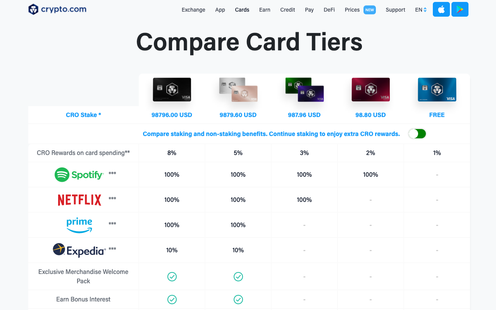

# Crypto.com cards, displayed in fiat currencies

## About

Chrome extension to display Crypto.com (CDC) cards in fiat.

Currently supported: CRO -> USD

Other currencies/derivatives to be added soon:
1. CRO -> MCO
2. CRO -> SGD

## Screenshots

